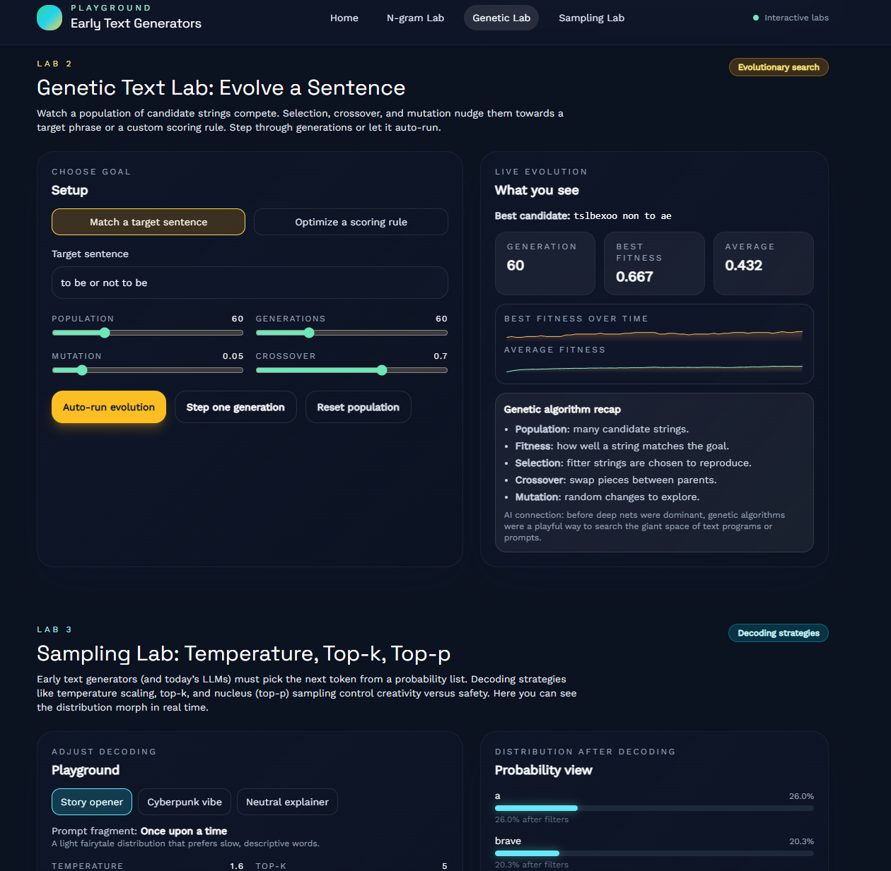

17 minutes - plenty of tests - no user interaction needed



# Early Text Generation Playground (Hermes)

Single-page React + TypeScript app that teaches three early text-generation ideas via interactive labs:

1. **N-gram Lab** – count-based next-token prediction, word/character modes, visualized distributions.
2. **Genetic Text Lab** – evolve strings toward a target or scoring rule with live fitness charts.
3. **Sampling Lab (Mystery Lab)** – temperature, top-k, and top-p decoding on a toy distribution to show how sampling knobs shape style.

Built with Vite + Tailwind, no backend required.

## Why Sampling Lab?

I considered three candidates: (a) beam search vs. greedy, (b) temperature/top-k/top-p sampling, (c) simple Markov vs. “true” LM memory. I chose **sampling** because it:

- Impacts every text generator (old n-grams through modern LLMs).
- Is easy to visualize with probabilities, no heavy model needed.
- Lets users feel creativity vs. safety trade-offs live.

Interaction plan: pick a prompt distribution, adjust temperature/top-k/top-p, watch the bar chart re-normalize, then sample a continuation.

## Running locally

```bash
npm install
npm run dev
```

Tests (Vitest, jsdom env):

```bash
npm test
```

## Project structure

- `src/sections/*` – page sections (landing + three labs)
- `src/lib/*` – core algorithms (n-gram, genetic algorithm, sampling)
- `src/components/*` – UI atoms (cards, sliders, charts)
- `src/data/*` – small sample corpora and toy logits

## What you’ll learn in each lab

- **N-gram Lab:** how context length changes predictions, counts → probabilities, failure on sparse data.
- **Genetic Lab:** population, fitness, selection, crossover, mutation; evolving text toward targets or custom rules.
- **Sampling Lab:** decoding knobs that reshape probability mass; why same model can sound deterministic or creative.

## Developer notes

- Modern, responsive UI with custom palette, Space Grotesk + Work Sans.
- Client-side algorithms only; no network or backend calls.
- Charts: lightweight SVG (sparkline) and simple div-based bars for clarity and zero deps.
- Hover tooltips on generated tokens show which context fed the n-gram step.

## Manual checking

- Run `npm run dev` and open the SPA; all interactions are client-side.
- Use the Genetic Lab auto-run to observe rising fitness; pause to step manually.
- Try Sampling Lab with temperature near 0.2 vs 1.6 to see deterministic vs. chaotic continuations.
